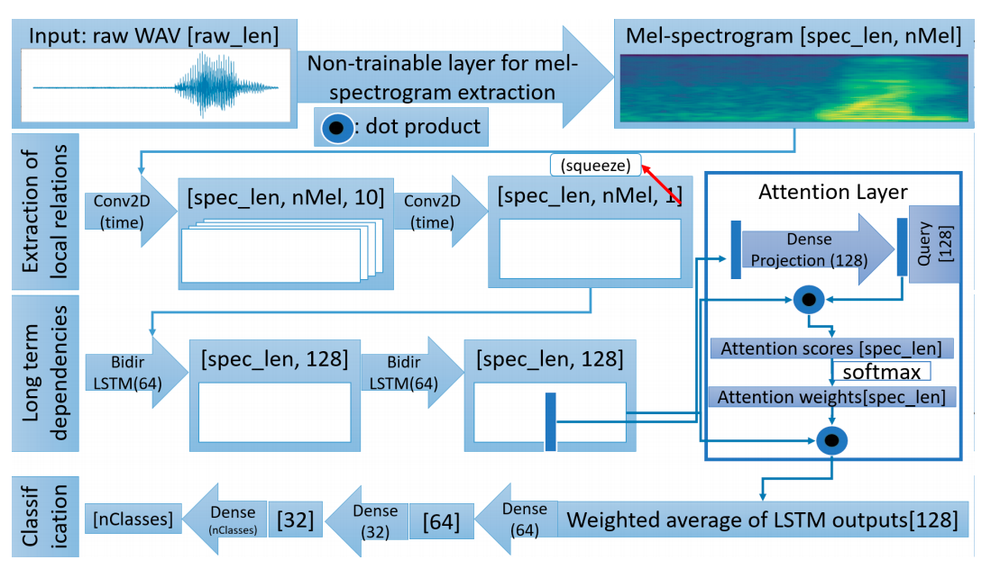

### Table of contents

1. [Introduction](#introduction)
2. [How to use `Blossom`](#how_to_use)
    - [Installation](#installation)
    - [Data structure](#data_structure)
    - [Example usage](#usage)

3. [Reference](#reference)


## <a name='introduction'></a> Blossom

Blossom is a library for Wake-up word detection problem use Multihead attention RNN (MHAtt-RNN) architecture. 




## <a name='how_to_use'></a> How to use Blossom

### Installation <a name='installation'></a>

```js

>>> python setup.py bdist_wheel

>>> pip install dist/blossom-0.0.1-py3-none-any.whl 

```

### <a name='data_structure'></a> Data Structure

```
data
    trigger
        train
            right
                right_1.wav
                right_2.wav
                ...
            
            on
                on_1.wav
                on_2.wav
                ...

            ...

        valid

        test

```

### <a name='usage'></a> Example usage


```py

import os

from blossom.models import MHAttKWS
from blossom.datasets import MHAttDataset
from blossom.learners import MHAttKWSLearner

def test_train():

    train_dataset = MHAttDataset(
        mode='train',
        root='./data/trigger'
    )
    valid_dataset = MHAttDataset(
        mode='valid',
        root='./data/trigger'
    )
    test_dataset = MHAttDataset(
        mode='test',
        root='./data/trigger'
    )

    model = MHAttKWS(
        num_classes=2,
        in_channel=1,
        hidden_dim=128,
        n_head=4,
        dropout=0.1
    )

    learner = MHAttKWSLearner(model=model)
    learner.train(
        train_dataset=train_dataset,
        test_dataset=test_dataset,
        batch_size=48,
        learning_rate=1e-4,
        eps=1e-8,
        betas=(0.9, 0.999),
        max_steps=5,
        n_epochs=1,
        shuffle=True,
        num_workers=8,
        view_model=True,
        save_path='./models',
        model_name='mhatt_model'
    )
    
test_train()


def test_inference():
    model = MHAttKWS(
        num_classes=2,
        in_channel=1,
        hidden_dim=128,
        n_head=4,
        dropout=0.1
    )

    learner = MHAttKWSLearner(model=model)
    learner.load_model(model_path='./models/mhatt_model.pt')

    output = learner.inference(input='data/trigger/test/on/5c8af87a_nohash_3.wav')

    print(output)


test_inference()


```


## <a name='reference'></a> Reference

1. Douglas Coimbra de Andrade, Sabato Leo, Martin Loesener Da Silva Viana and Christoph Bernkopf: “[A neural attention model for speech command recognition](https://arxiv.org/abs/1808.08929)”, in arXiv:1808.08929, 2018.

2. Oleg Rybakov, Natasha Kononenko, Niranjan Subrahmanya, Mirko Visontai and Stella Laurenzo: “[Streaming keyword spotting on mobile devices](https://arxiv.org/abs/2005.06720)”, in arXiv:2005.06720, 2020.


## Author

- Name: Phan Xuan Phuc
- Email: phanxuanphucnd@gmail.com

_(To request sample data for experiment. Please contact by my email. )_
